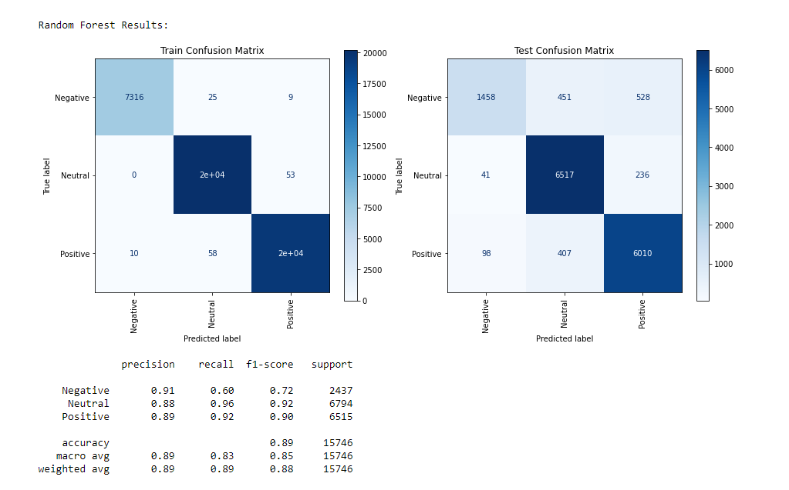
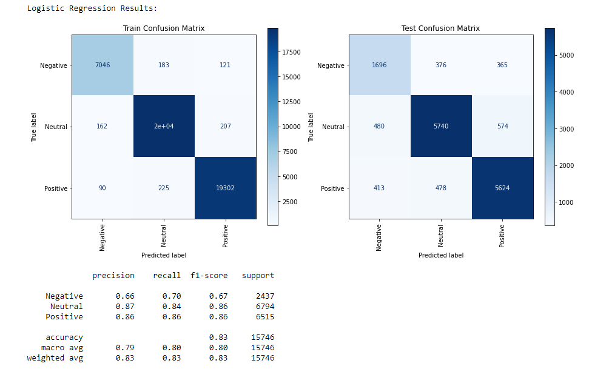

# Twitter Sentiment Analysis of iPhone 13 Release
The iPhone 13 is Apple's latest model, released on September 24, 2021.

Twitter has become a medium where people freely express their thoughts and opinions on a wide variety of topics, including recent product releases like iPhone 13.

The purpose of this analysis is to look at tweets about the iPhone 13, determine if the tweet is positive, negative, or neutral, and then use this information to determine the public’s response to various iPhone features.

This information can be used to analyze how consumers respond to the key features of iPhone 13 to be used by marketing and product development in order to identify improvements that could be highlighted for future iPhone models.

# Tweet Collecting and Cleaning

Twint was used to collect tweets from Twitter. 

Twint is an advanced Twitter scraping tool written in Python that allows for scraping Tweets from Twitter profiles without using Twitter's API.

129,344 tweets in all languages were collected from September 26, 2021, to October 9, 2021.

The sentiment analysis was done on just English tweets, so the number of tweets used in the analysis was reduced to just 63,799 once other languages were removed.

In order to gauge the sentiment of each tweet, lemmatization was used to remove all common words, special characters, web links, and numbers from each tweet.

Each tweet was then tokenized and a new column added in preparation for sentiment analysis.

# Sentiment Analysis

VADER was used to determine whether a tweet was positive, negative, or neutral based on its Compound score.

This sentiment would be used to create a model that could accurately predict the sentiment of a tweet.

Wordclouds were generated for positive and negative sentiments just to evaluate the initial sentiment analysis.

# Modeling

A number of different models were used in order to determine which model does the best job at predicting the sentiment of tweets.

The model that perfomed the best overall was the Random Forest model with a Precision score of 89.46% and an accuracy score of 88.82%

However, the Random Forest model also generated a high number of false negatives and proved to not be particularly accurate when predicting negative tweets, even though it was accurate in predicting positive and neutral tweets.

That could be explained by a class imbalance in the dataset, with 84.5% of tweets falling in the categories of Positive or Neutral.

The model that did the best at predicting negative tweets was Logistic Regression with a negative recall score of 70% and could be used if an analysis is more focused on predicting negative tweets since it also gives a decent balance of predicting all classifications.

# Conclusions

* Overall reaction on the iPhone 13 was positive or neutral, showing that consumers were relatively pleased.

* The most talked about aspect of the iPhone on Twitter is pro and max, showing that consumers are reacting more to both the Pro and the Prox Max model of iPhone 13. This could mean that the features of those model, such as a larger screen and better camera, are favored by consumers.

* People are more focused on improvements to battery life and the camera and react accordingly.

* Upgrading is also talked about on Twitter and negative reactions to upgrading could be due to updated features.

## Future Recommendations

* Analysis of how Twitter sentiment affects stock market price could be looked at in order to get a better sense of how public opinion impacts Apple’s financial profile.

* Time series modeling could also be used to see how Twitter sentiment changes over time, as well as use that to compare with financial data.

* This analysis was just done over a two-week period immediately after release. Further analysis could be done over a longer period of time.

* Modeling Twitter sentiment is limited to current trends because of the Twitter API only allowing you to gather tweets that are seven days old. Historical Twitter data is no longer available.
